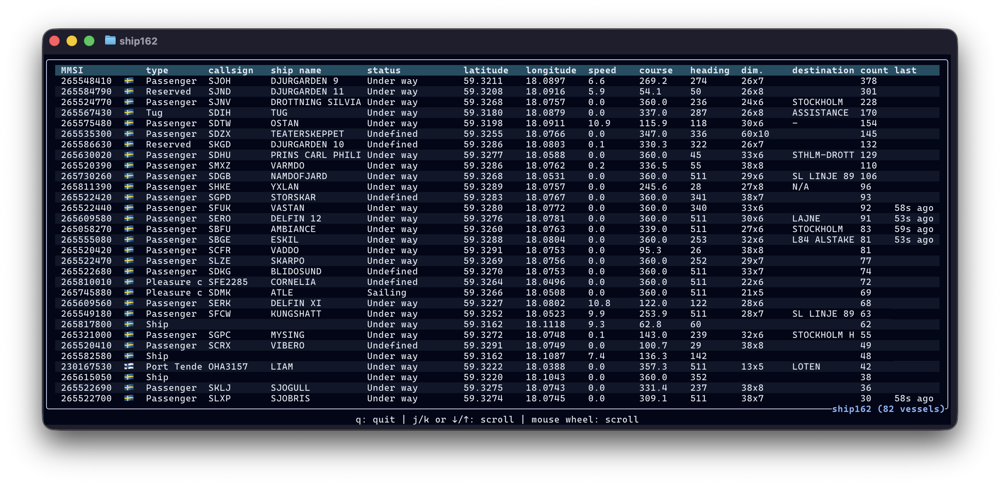

# ship162

**ship162** is a complete maritime tracking application that includes the rs162 Rust library for decoding AIS (Automatic Identification System) messages from binary feeds and NMEA sentences using the `deku` library for clean, declarative binary data parsing.

The library takes its inspiration from the Python [pyais](https://github.com/M0r13n/pyais/) library and leverages [deku](https://github.com/sharksforarms/deku) to provide efficient, type-safe AIS message decoding. The major specificity compared to other implementations is the deku-based decoder, which enables clean bit-level parsing with compile-time guarantees.

The directions ambitioned by ship162 include:

- providing high-performance AIS decoding in Rust;
- offering efficient multi-receiver AIS decoding;
- serving real-time enriched maritime data to external applications;
- **end-to-end demodulation and decoding** from SDR hardware to structured data.

The ultimate goal is to create a complete maritime tracking solution that can receive raw radio signals and output structured AIS data, similar to what dump1090 does for aviation ADS-B messages.



## Features

- **Complete AIS message support**: Handles all standard AIS message types (1-27)
- **NMEA sentence parsing**: Full support for AIVDM/AIVDO messages with multi-fragment assembly
- **Type-safe decoding**: Leverages Rust's type system and deku for reliable parsing
- **JSON serialization**: Built-in serde support for easy data export
- **Real-time processing**: Efficient handling of live AIS data streams
- **Multi-fragment messages**: Automatic assembly of multi-sentence AIS messages

## Similar Projects

- [AIS-catcher](https://github.com/jvde-github/AIS-catcher) in C++
- [pyais](https://github.com/M0r13n/pyais/) in Python
- [ais](https://github.com/squidpickles/ais) or [nmea-parser](https://github.com/zaari/nmea-parser) in Rust

The key differentiator of ship162 is its use of deku for declarative binary parsing, providing both performance and correctness guarantees that are difficult to achieve with manual bit manipulation.

## Future Roadmap

The long-term vision for ship162 is to become a complete **end-to-end demodulation and decoding application** that can:

- Receive raw RF signals from SDR hardware
- Demodulate AIS signals (161.975 MHz and 162.025 MHz)
- Decode NMEA sentences in real-time
- Provide Python and WebAssembly bindings
- Offer a complete maritime tracking solution

This will make ship162 the maritime equivalent of rs1090 for aviation tracking.

## Installation

Run the following Cargo command in your project directory:

```sh
cargo add rs162
```

Or add the following line to your `Cargo.toml`:

```toml
rs162 = "0.1.0"  # check for the latest version
```

## Usage

### Basic AIS Message Decoding

```rust
use rs162::decode::ais::Message;

fn main() -> Result<(), Box<dyn std::error::Error>> {
    // Single NMEA sentence
    let nmea = "!AIVDM,1,1,,B,15M67FC000G?ufbE`FepT@3n00Sa,0*5C";
    let message = Message::from_nmea(&[nmea])?;

    // Convert to JSON
    let json = serde_json::to_string(&message)?;
    println!("{}", json);

    Ok(())
}
```

### Multi-fragment Messages

```rust
use rs162::decode::ais::Message;

fn main() -> Result<(), Box<dyn std::error::Error>> {
    // Multi-sentence Type 5 static and voyage data
    let sentences = [
        "!AIVDM,2,1,1,A,55?MbV02;H;s<HtKR20EHE:0@T4@Dn2222222216L961O5Gf0NSQEp6ClRp8,0*1C",
        "!AIVDM,2,2,1,A,88888888880,2*25",
    ];

    let message = Message::from_nmea(&sentences)?;
    let json = serde_json::to_string(&message)?;
    println!("{}", json);

    Ok(())
}
```

### Processing NMEA Files

```sh
# See examples/nmea_file.rs for a complete file processor
cargo run --example nmea_file
```

### Real-time TCP Stream Processing

```sh
# See examples/nmea_tcp.rs for live AIS data processing
# Connects to Norwegian Coastal Administration's free AIS feed
cargo run --release --example nmea_tcp -- 153.44.253.27:5631 | \
  jq -c '.message + .mmsi_info + {timestamp: (.timestamp | strftime("%Y-%m-%dT%H:%M:%SZ"))}'
```

### Demodulating from I/Q Samples

```sh
# See examples/iqfile.rs for processing I/Q sample files
cargo run --release --example iqfile | \
  jq -c '.message + .mmsi_info + {timestamp: (.timestamp | strftime("%Y-%m-%dT%H:%M:%SZ"))}'
```

### Demodulating from `rtl_tcp`

```sh
# See examples/rtltcp.rs
rtl_tcp -a 127.0.0.1 -p 1234 -f 162M -s 288k -g 49.6
cargo run --release --example rtltcp | \
  jq -c '.message + .mmsi_info + {timestamp: (.timestamp | strftime("%Y-%m-%dT%H:%M:%SZ"))}'
```

### Demodulating from RTL-SDR Devices

> [!WARNING]  
> Please read the following important note for Linux users: <https://github.com/ccostes/rtl-sdr-rs#uload-kernel-modules>

```sh
# See examples/rtlsdr.rs
cargo run --release --example rtlsdr | \
  jq -c '.message + .mmsi_info + {timestamp: (.timestamp | strftime("%Y-%m-%dT%H:%M:%SZ"))}'

# See examples/rtlsdr_async.rs
cargo run --release --example rtlsdr_async | \
  jq -c '.message + .mmsi_info + {timestamp: (.timestamp | strftime("%Y-%m-%dT%H:%M:%SZ"))}'
```

## Technical Standards

The library implements:

- **IEC 61162-1**: Maritime navigation digital interfaces (NMEA 0183)
- **ITU-R M.1371**: Technical characteristics for AIS
- **IEC 62320-1**: AIS transponder equipment standards

## Data Sources

### Norwegian Coastal Administration

Real-time AIS data is freely available from the Norwegian Coastal Administration:

- **Host**: 153.44.253.27
- **Port**: 5631
- **Format**: IEC 61162-1 (NMEA with timestamps)
- **License**: Norwegian license for public data

## Agent-based coding

Most of the codebase has been generated with the assistance of Claude Sonnet 4, using specifications from:

- [GPSD AIVDM documentation](https://gpsd.gitlab.io/gpsd/AIVDM.html)
- Test cases adapted from the [pyais](https://github.com/M0r13n/pyais/) library
- ITU-R M.1371 specifications

## Contributing

Contributions are welcome! The project particularly benefits from:

- Real-world test cases and data samples
- Performance optimizations
- Documentation improvements

## License

This project is licensed under the MIT License. See the license file for details.
