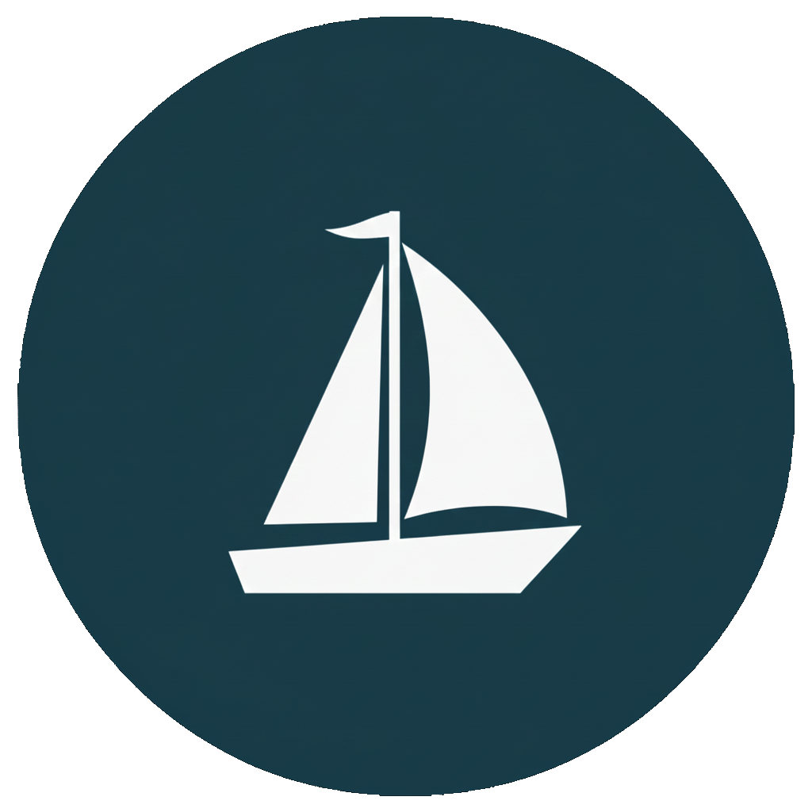

<div align="center">
  
</div>

# ship162

**ship162** is a lightweight maritime AIS receiver and decoder, the maritime equivalent of [jet1090](https://github.com/xoolive/jet1090/) for aviation.

It decodes AIS (Automatic Identification System) messages from SDR hardware, TCP feeds, WebSocket streams, and MQTT brokers, and can display them in a real-time terminal dashboard.


## Installation

Pre-built binaries for Linux, macOS, and Windows are available on the [GitHub Releases](https://github.com/xoolive/ship162/releases) page.

**Shell installer** (Linux and macOS):

```sh
curl --proto '=https' --tlsv1.2 -LsSf https://github.com/xoolive/ship162/releases/latest/download/ship162-installer.sh | sh
```

**Homebrew** (macOS):

```sh
brew install xoolive/homebrew/ship162
```

**Cargo**:

```sh
cargo install ship162
```

**Arch OS** (AUR):

```sh
yay -S ship162-bin
```

### Building from source

The default build includes RTL-SDR, Airspy, HackRF, and SSH support:

```sh
cargo install --git https://github.com/xoolive/ship162
```

MQTT support requires an extra C build dependency ([paho-mqtt](https://github.com/eclipse/paho.mqtt.c)) and must be opted into explicitly:

```sh
cargo install ship162 --features mqtt
```

### Linux: detach the kernel DVB driver

The RTL-SDR, Airspy, and HackRF backends use a pure-Rust USB driver ([nusb](https://github.com/kevinmehall/nusb)) that talks directly to the USB subsystem. On Linux you need to unload the kernel DVB modules first so they do not hold the device:

```sh
sudo modprobe -r dvb_usb_rtl28xxu rtl2832
```

To make this permanent, blacklist the module:

```sh
echo 'blacklist dvb_usb_rtl28xxu' | sudo tee /etc/modprobe.d/rtlsdr.conf
```

## Usage

Run `ship162 --help` for the full list of options. The most common invocations:

```sh
# Interactive TUI with an RTL-SDR dongle
ship162 --interactive rtlsdr://

# JSON output from the Norwegian Coastal Administration free feed
ship162 --verbose tcp://153.44.253.27:5631

# Write to a file while also displaying the TUI
ship162 --interactive --output ais.jsonl rtlsdr://
```

## Configuration file

Settings and sources can be stored in a TOML file. ship162 looks for configuration in order:

1. `$SHIP162_CONFIG` (environment variable)
2. `$XDG_CONFIG_HOME/ship162/config.toml`
3. `~/.config/ship162/config.toml`

```toml
interactive = true

[[sources]]
rtlsdr = { device = 0 }
gain = 49.6

[[sources]]
tcp = "153.44.253.27:5631"
```

See [`config.toml.example`](config.toml.example) for the full reference with all sources and options.

## Sources

### SDR hardware

All SDR sources accept `gain`, `sample_rate`, and `bias_tee` at the source level. If `gain` is omitted, ship162 applies its AIS per-device default; `gain = "auto"` explicitly requests device automatic gain control where supported:

```toml
# RTL-SDR (default gain 49.6 dB)
[[sources]]
rtlsdr = { device = 0 }
gain = 49.6
bias_tee = false

# Airspy R2 or Mini (default gain 50, sensitivity mode)
[[sources]]
airspy = { device = 0 }
gain = 50
sample_rate = 6000000

# HackRF (default LNA=40 dB, VGA=55 dB)
[[sources]]
hackrf = { device = 0, amp_enable = true }

# Airspy Mini via SoapySDR at 3 MS/s
[[sources]]
soapy = "driver=airspy"
sample_rate = 3000000
gain = 49.6
```

### TCP

TCP sources reconnect after a fixed five-second delay by default. Configure the delay per source with `retry`:

```toml
[[sources]]
tcp = "153.44.253.27:5631"

# With SSH tunnel (built-in, no openssh needed)
[[sources]]
tcp = { host = "remote-host", port = 5631, jump = "jumphost" }
# optional
retry = { strategy = "fixed", delay_seconds = 10 }
```

### WebSocket

WebSocket sources also use the same fixed-delay retry policy by default:

```toml
[[sources]]
ws = "ws://remote-host:88888"
# optional
retry = { strategy = "fixed", delay_seconds = 10 }
```

### MQTT

Requires building with `--features mqtt`. Connects to the [Finnish Digitraffic](https://www.digitraffic.fi/en/marine-traffic/) broker by default:

```toml
[[sources]]
mqtt = "mqtt://mqtt.digitraffic.fi"
```

## Output

Decoded messages are emitted as JSON on stdout (`--verbose`), written to a file (`--output`), or published to Redis (`--redis-url`). Verbose and interactive modes are mutually exclusive because each requires stdout; `--log-file -` is likewise unavailable with either mode. The application can also re-broadcast decoded NMEA sentences to downstream consumers:

```sh
# Serve NMEA over TCP for other applications (e.g. OpenCPN)
ship162 --serve-tcp 0.0.0.0:5631 rtlsdr://

# Forward to a UDP endpoint
ship162 --serve-udp 0.0.0.0:5632 rtlsdr://
```

## Free AIS data sources

| Source                           | Address                      | Notes                            |
| -------------------------------- | ---------------------------- | -------------------------------- |
| Norwegian Coastal Administration | `tcp://153.44.253.27:5631`   | IEC 61162-1 NMEA with timestamps |
| Finnish Digitraffic              | `mqtt://mqtt.digitraffic.fi` | Requires `--features mqtt`       |

## Similar projects

- [AIS-catcher](https://github.com/jvde-github/AIS-catcher) — C++, very comprehensive SDR support
- [pyais](https://github.com/M0r13n/pyais/) — Python decoder
- [ais](https://github.com/squidpickles/ais) / [nmea-parser](https://github.com/zaari/nmea-parser) — Rust decoders

## License

MIT — see [license.md](license.md).
